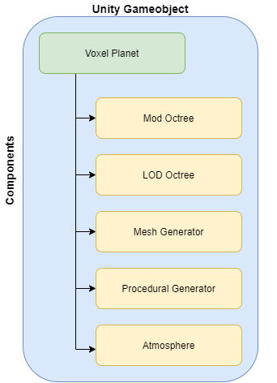

# Voxel Planets

# Description 
Dynamic Planet Generator is a Unity-based project that leverages advanced voxel terrain generation techniques to create unique and dynamic planets in real-time. This project is ideal for game developers and enthusiasts interested in procedural generation, astrophysics simulations, or just creating visually stunning planetary landscapes.

# Features

Real-time Voxel Terrain Generation: Create and manipulate voxel-based terrains in real-time, offering endless possibilities for landscape customization.
Dynamic Planet Creation: Each planet generated is unique, with its own set of characteristics like size, color, terrain type.
Optimized Performance: Built with performance in mind, ensuring smooth generation and rendering of complex terrains on various devices.

# Getting Started 
These instructions will get you a copy of the project up and running on your local machine for development and testing purposes.

# Installing
Installing
Clone the repo: git clone https://github.com/ColinSp12/voxel-planets-master/
Open Unity and select 'Open Project.'
Navigate to the cloned repository folder and open it.
Unity will import all necessary files and assets.

## Overview

## Instructions 
Unity Project: 
- Version 2020.3  
- High Definition Render Pipeline (HDRP)  

To play the demo, download the Demo.zip and execute VoxelPlanets.exe. 

Recommended hardware to play the demo (1920x1080, 60 fps):
- Intel i5 8400 or equivalent
- Nvidia GTX 1060 or equivalent
- 1-2 GB free RAM

# License 
Distributed under the MIT License. See LICENSE for more information.

# Inspiration
- Sebastian Lague
- reddit.com/user/johnny_dalvi/
